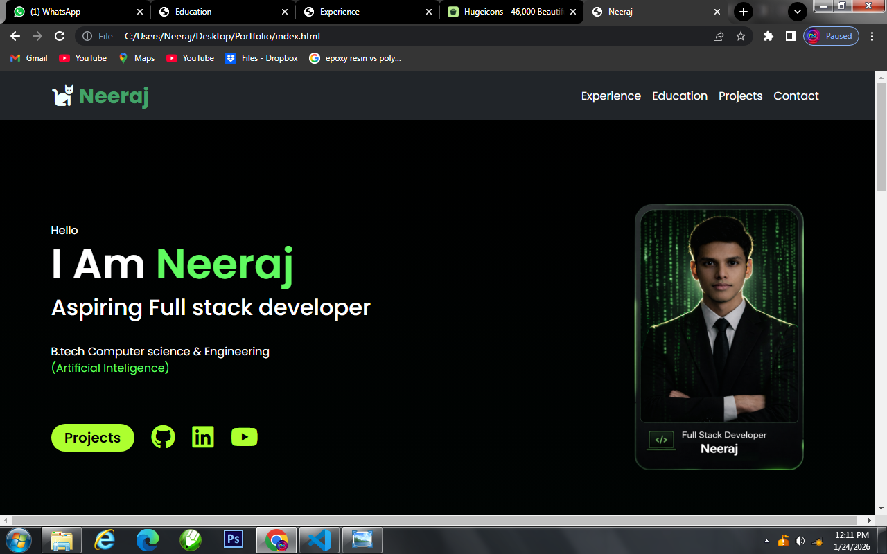
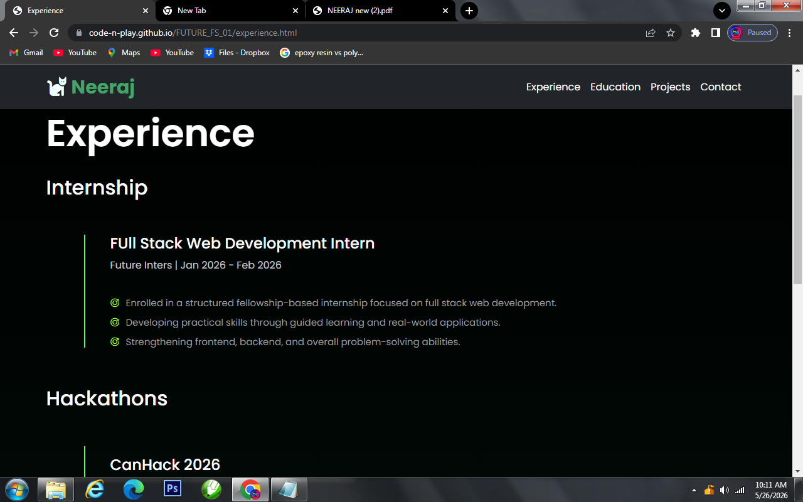
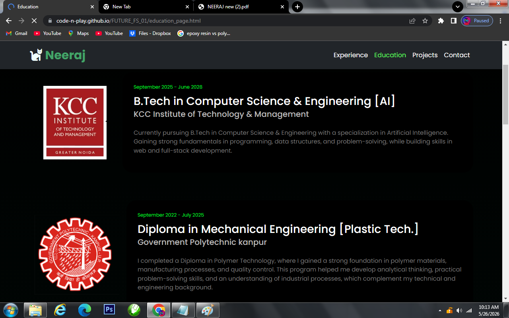
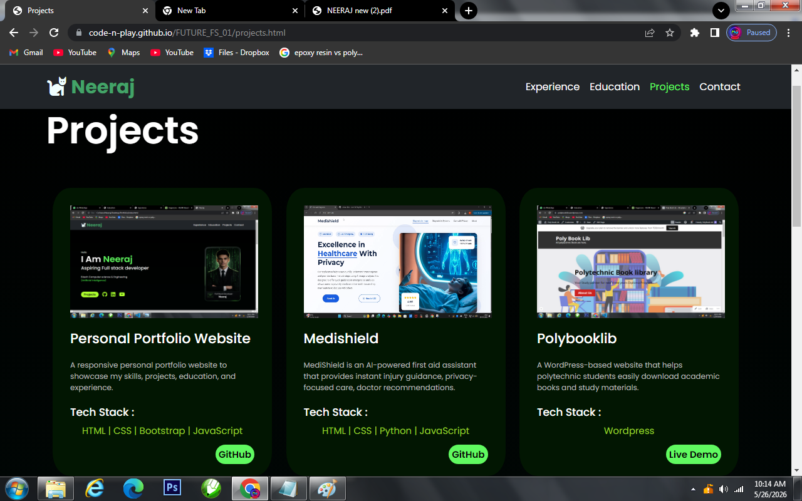

# Personal Portfolio 

Welcome to my personal protfolio website project

This portfolio showcase my skills,projects, achivments, and web development journey with a morden and responsive design. 

## live Demo 
```bash
code-n-play.github.io/FUTURE_FS_01/index.html
```

## Keyfeatures
- Responsive Design
- Smooth Scrolling Navigation
- Mordern UI/UX
- Projects showcase section
- Skills & About Me section
- Contact section
- Clean and Interactive Interface

### Images

<div style="display: flex;flex-direction: column; grid-gap: 10px;">
     <div style="display: flex; grid-gap: 10px;">
        
        
        
        
    </div>
</div>
  
---

## Tech Stack:
- HTML
- CSS
- Java Script
- Bootstrap

---
